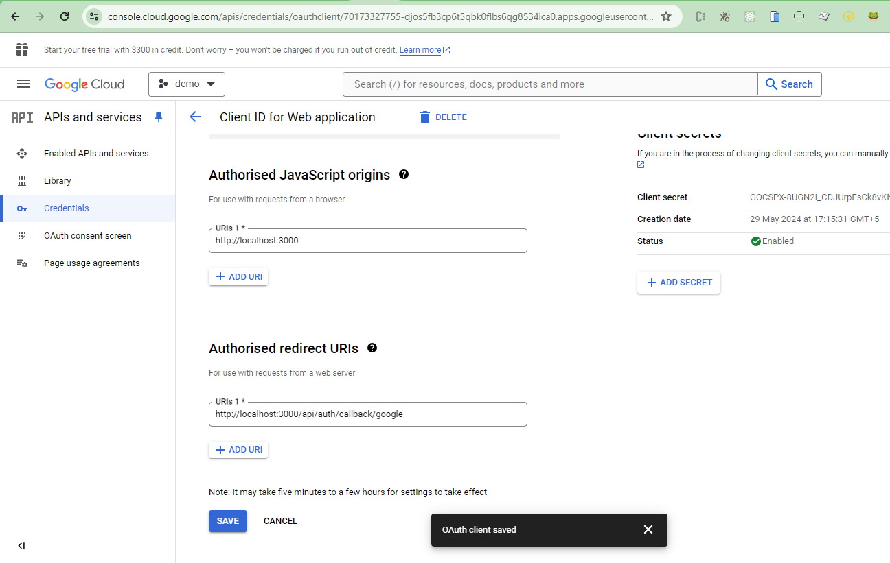

`npm install @auth/core`

#### Response of signIn callback

```json
{
  user: {
    id: '',
    name: 'Himanshu Kumar',
    email: 'himanshu064@gmail.com',
    image: ''
  },
  account: {
    access_token: '',
    expires_in: 3599,
    refresh_token: '',
    scope: 'https://www.googleapis.com/auth/userinfo.email https://www.googleapis.com/auth/userinfo.profile openid',
    token_type: 'bearer',
    id_token: '',
    expires_at: 1717051949,
    provider: 'google',
    type: 'oidc',
    providerAccountId: ''
  },
  profile: {
    iss: 'https://accounts.google.com',
    azp: '',
    aud: '',
    sub: '',
    email: 'himanshu064@gmail.com',
    email_verified: true,
    at_hash: 'SOZ_LKImW2leKL9Tybca6g',
    name: 'Himanshu Kumar',
    picture: '',
    given_name: 'Himanshu',
    family_name: 'Kumar',
    iat: 1717048349,
    exp: 1717051949
  },
  email: undefined,
  credentials: undefined
}
```

#### Inside session callback
```json
{
  session: {
    user: {
    name: 'Himanshu Kumar',
    email: 'himanshu064@gmail.com',
    image: ''
  },
  expires: '2024-06-29T06:10:12.699Z'
},
  user: undefined,
  token: {
    name: 'Himanshu Kumar',
    email: 'himanshu064@gmail.com',
    picture: '',
    sub: '',
    iat: 1717048350,
    exp: 1719640350,
    jti: '91c973cc-8e11-45da-b960-01bcb7288893'
  }
}
```

#### Inside jwt callback
```json
{
  token: {
    name: 'Himanshu Kumar',
    email: 'himanshu064@gmail.com',
    picture: '',
    sub: ''
  },
  user: {
    id: '',
    name: 'Himanshu Kumar',
    email: 'himanshu064@gmail.com',
    image: ''
  },
  account: {
    access_token: '',
    expires_in: 3599,
    refresh_token: '',
    scope: 'https://www.googleapis.com/auth/userinfo.email https://www.googleapis.com/auth/userinfo.profile openid',
    token_type: 'bearer',
    id_token: '',
    expires_at: 1717051949,
    provider: 'google',
    type: 'oidc',
    providerAccountId: ''
  },
  profile: {
    iss: 'https://accounts.google.com',
    azp: '',
    aud: '',
    sub: '',
    email: 'himanshu064@gmail.com',
    expires_at: 1717051949,
    provider: 'google',
    type: 'oidc',
    providerAccountId: ''
  },
  profile: {
    iss: 'https://accounts.google.com',
    azp: '',
    aud: '',
    sub: '',
    email: 'himanshu064@gmail.com',
    email_verified: true,
    at_hash: 'SOZ_LKImW2leKL9Tybca6g',
    name: 'Himanshu Kumar',
    picture: '',
    given_name: 'Himanshu',
    family_name: 'Kumar',
    iat: 1717048349,
    exp: 1717051949
  }
}

```

#### Google cloud console




#### Signout using server component

```js
import { signOut } from "@/auth";

<form action={async () => {
    "user server";
    await signOut();
}}>
  <button type="submit">Sign Out</button>
</form>

```